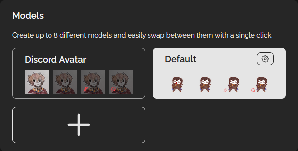
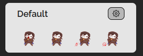
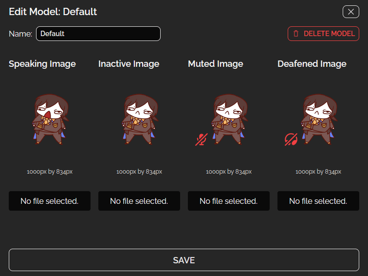
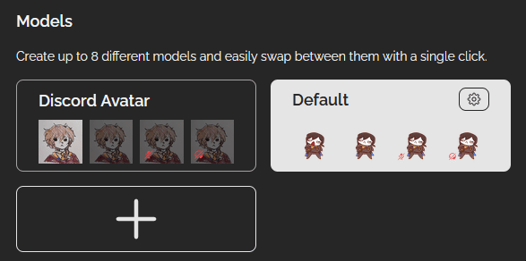
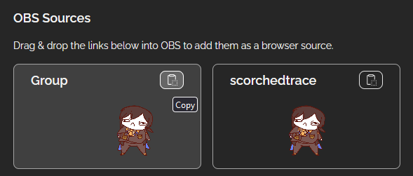
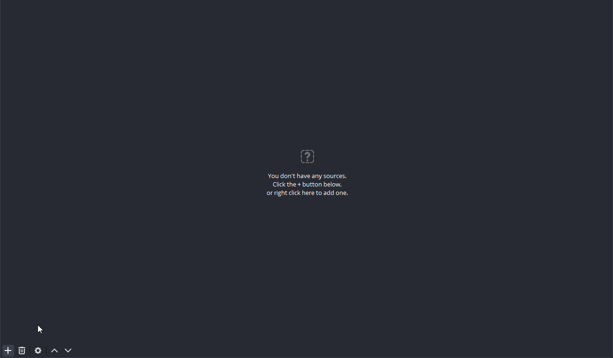
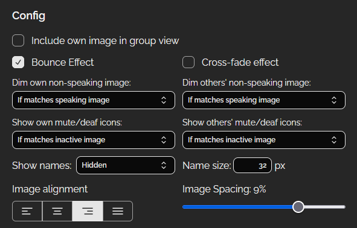
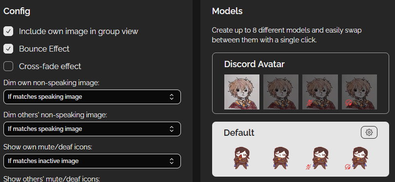

[Discord Reactive by FugiTech](https://reactive.fugi.tech/) (as of version 4.2.1 Tue Apr 23 2024)

## Set your png states for others to use

- Go to "Models" section

- Click on settings icon ⚙️ on any of your model
	- You can add more model by clicking the "+" sign button

- Set images you want to use
- Click "Save" to save the model

- Make sure you're selecting the model you're using by clicking on it

Now you got a model to show in a collab! 🎉

## Get browser source to put in your obs
#### In Reactive Fugi Tech

- Go to "Obs Sources" section
- On "Group", click the clipboard button to copy the link
#### Now, go to your obs

- Go to your desired scene and add a new "Browser Source" item
	- Should be a good idea to rename the browser source (ie. Reactive Images, FugiTech, Friends, etc)
- Open the browser source's properties and put the copied link into "URL"
- Move the new reactive images source to your desired position

Now you got friends on your stream when doing discord call!🥳🎉
## Config
A few essential options in https://reactive.fugi.tech/

- Include own image in group view: Just toggle it off if you already have your model

- Dim other's non-speaking image: The default "If matches speaking image" helps with dimming someone's image that doesn't have an open-close states
- Show names: "Hidden" if you want
- Image alignment: In my opinion, if you put your model on the right side, just pick the "right" alignment to always keep your friends' reactive images right beside your model
